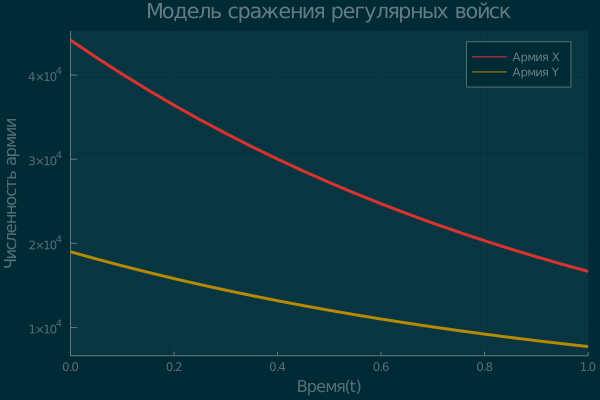
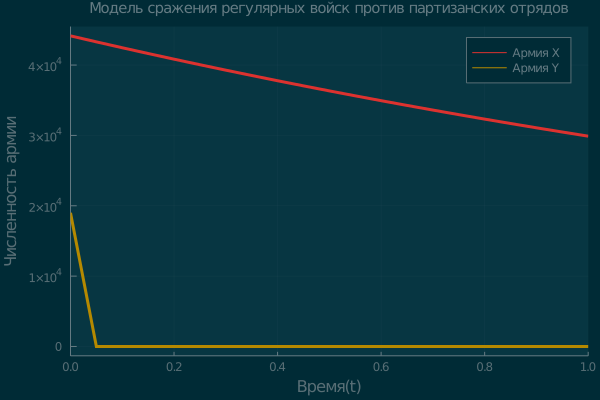

---
## Front matter
lang: ru-RU
title: Модель боевых действий
author: |Карташова А.С
institute: |
	\inst{1}RUDN University, Moscow, Russian Federation
date: 2021, 26 february
## Formatting
toc: false
slide_level: 2
theme: metropolis
header-includes:
 - \metroset{progressbar=frametitle,sectionpage=progressbar,numbering=fraction}
 - '\makeatletter'
 - '\beamer@ignorenonframefalse'
 - '\makeatother'
aspectratio: 43
section-titles: true
---
# Цель работы

Изучить и построить простейшие модели боевых действий(модели Ланчестера)

# Выполнение лабораторной работы

## Модель боевых действий между регулярными войсками

$$ \begin{cases}
\frac{dx}{dt} =  -0,57x(t)-0,91y(t)+sin(5t)+1
\\
\frac{dx}{dt} =  - 0,31x(t)-0,2y(t)+cos(3t)+2
\end{cases}
$$


## Коэффиценты

Начальные данные:
- $x_0$ = 44150
- $y_0$ = 19000

Коэффиценты:
- $a =  -0,57, h=-0,2$ - потери, не зависящие от боевых действий
- $b =  -0,91, c = -0,31$ - потери на поле боя
- $P(t) = sin(5t)+1, Q(t)= cos(3t)+2$- подход подкрепления


## Решение
Задаем начальные значения и коэффиценты:
```
x0 = 44150;
y0 = 19000;
 a = 0.57
 h = 0.2
 b = 0.91;
 c = 0.31;

```
## Решение

Задаем функции, описывающие подход подкрепления

```
P(t) = sin(5t)+1
Q(t) = cos(3t)+2
```
Задаем систему дифференциальных уравнений:
```
function model!(du, u, p, t)
     du[1]=-a*u[1]-b*u[2]+P(t)
     du[2]=-c*u[1]-h*u[2]+Q(t)
     end
````
## Решение

Решение системы:

```
u0 = [x0;y0];
taspan = (0.0,1.0)
prob = ODEProblem(model!,u0,tspan)
sol = solve(prob)

```
## Решение

Вывод графика:
```
pl = plot(sol,title = "Модель сражения регулярных войск",
label = ["Армия X" "Армия Y"],
 xlabel = "Время(t)",
 ylabel= "Численность армии",
 lw = 3)
 display(pl)
savefig(pl,"1.png")

```
## Решение: График №1

График для модели боевых действий 2-х регулярных армий (рис. -@fig:001)

{ #fig:001 width=70% }


## Модель боевых действий между регулярными войсками и партизанской армией

$$ \begin{cases}
\frac{dx}{dt} =  -0,39x(t)-0,86y(t)+sin(2t)+1
\\
\frac{dx}{dt} =  - 0,39x(t)y(t)-0,21y(t)+cos(2t)+1
\end{cases}
$$

## Коэффиценты

- $a =  0,39, h=0,21$ - потери, не зависящие от боевых действий
- $b = = 0,86, c = 0,39$ - потери на поле боя
- $P(t) = sin(2t)+1, Q(t)= cos(2t)+1$- подход подкрепления

## Решение

Решение CДУ

```
function model2!(du, u, p, t)
     du[1]=-a*u[1]-b*u[2]+P(t)
     du[2]=-c*u[1]*u[2]-h*u[2]+Q(t)
     end
prob = ODEProblem(model2!,u0,tspan)
sol = solve(prob, saveat = 0.05);
```
## Решение: График №2
Графики модели боевых действий между регулярной армией и  партизанскими войсками (рис. -@fig:002)

{ #fig:002 width=70% }


# Выводы

В результате проделанной работы мы изучили модели боевых действий и построили графики простейших моделей
