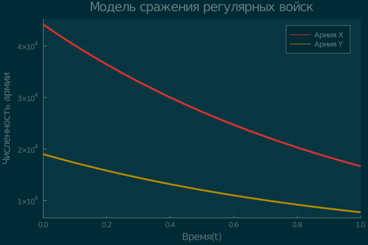
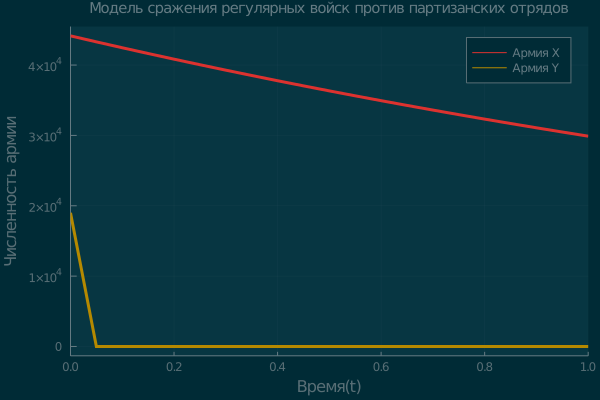

---
# Front matter
lang: ru-RU
title: "Отчет по лабораторной работе №3: Модель боевых действий"
subtitle: "*дисциплина: Математическое моделирование*"
author: "Карташова Алиса Семеновна, НФИбд-03-18"

# Formatting
toc-title: "Содержание"
toc: true # Table of contents
toc_depth: 2
lof: true # List of figures
lot: true # List of tables
fontsize: 12pt
linestretch: 1.5
papersize: a4paper
documentclass: scrreprt
polyglossia-lang: russian
polyglossia-otherlangs: english
mainfont: PT Serif
romanfont: PT Serif
sansfont: PT Sans
monofont: PT Mono
mainfontoptions: Ligatures=TeX
romanfontoptions: Ligatures=TeX
sansfontoptions: Ligatures=TeX,Scale=MatchLowercase
monofontoptions: Scale=MatchLowercase
indent: true
pdf-engine: luatex
header-includes:
  - \linepenalty=10 # the penalty added to the badness of each line within a paragraph (no associated penalty node) Increasing the value makes tex try to have fewer lines in the paragraph.
  - \interlinepenalty=0 # value of the penalty (node) added after each line of a paragraph.
  - \hyphenpenalty=50 # the penalty for line breaking at an automatically inserted hyphen
  - \exhyphenpenalty=50 # the penalty for line breaking at an explicit hyphen
  - \binoppenalty=700 # the penalty for breaking a line at a binary operator
  - \relpenalty=500 # the penalty for breaking a line at a relation
  - \clubpenalty=150 # extra penalty for breaking after first line of a paragraph
  - \widowpenalty=150 # extra penalty for breaking before last line of a paragraph
  - \displaywidowpenalty=50 # extra penalty for breaking before last line before a display math
  - \brokenpenalty=100 # extra penalty for page breaking after a hyphenated line
  - \predisplaypenalty=10000 # penalty for breaking before a display
  - \postdisplaypenalty=0 # penalty for breaking after a display
  - \floatingpenalty = 20000 # penalty for splitting an insertion (can only be split footnote in standard LaTeX)
  - \raggedbottom # or \flushbottom
  - \usepackage{float} # keep figures where there are in the text
  - \floatplacement{figure}{H} # keep figures where there are in the text
---

# Введение

## Цель работы

Онсновная цель работы - изучить и построить простейшие модели боевых действий(модели Ланчестера)

## Задачи работы

Выделим основные задачи работы:

1. Рассмотреть три случая ведения боевых действий;
2. Построить график изменения числености двух армий для случая боевых действий между регулярными войсками;
3. Построить график изменения числености двух армий для случая ведения боевых действий с участием регулярных войск и партизанских отрядов.

## Объект и предмет исследования

Объектом исследований для данной лабораторной работы являются модели Ланчестера. Предметом исследования можно назвать различные случаи боевых моделей, а так же простейшие модели с постоянными коэфицентами

# Терминология. Условные обозначения

 Рассмотрим три случая ведения боевых действий:

 1. Между регулярными войсками
 2. С участием регулярной армии и партизанских отрядов
 3. Между партизанскими отрядами

## Первый случай

 $$ \begin{cases}
\frac{dx}{dt} =  -a(t)x(t) - b(t)y(t)+P(t)
\\
\frac{dx}{dt} =  -c(t)x(t) - h(t)y(t)+Q(t)
\end{cases}
$$

- $-a(t)x(t) и -h(t)y(t)$ - потери, не связанные с боевыми действиями.$a(t), h(t)$ - характеризуют степень влияния различных факторов на потери(болезни, дезертирство и т.д)

- $b(t), c(t)$ - коэффиценты, указывающие на эффективность боевых действий со стороны $y$ и $x$ соответственно.

## Второй случай

В этом случае считается, что темп потерь партизан, проводящих свои операции в разных местах на неизвестной территории, пропорционален не только численности армейских соединенй, но и численности самих партизан

$$ \begin{cases}
\frac{dx}{dt} =  -a(t)x(t) - b(t)y(t)+P(t)
\\
\frac{dx}{dt} =  -c(t)x(t)y(t) - h(t)y(t)+Q(t)
\end{cases}
$$

## Третий случай


$$ \begin{cases}
\frac{dx}{dt} =  -a(t)x(t) - b(t)x(t)y(t)+P(t)
\\
\frac{dx}{dt} =  -c(t)x(t)y(t) - h(t)y(t)+Q(t)
\end{cases}
$$

## Простейшие модели(с постоянными коэффицентами)

### Первый случай
Факторы, влияющие на модель:

 - $b, c$ - постоянны
 - Не учитваются потери, не с вязанные с боевыми действиями(коэффиценты $a(t), c(t)$)
 - Не учитывается возможность подхода подкрепления:
 - $x, y$ - численность противостоящих армий

 $$ \begin{cases}
 \frac{dx}{dt} =  - b(t)y(t)
 \\
 \frac{dx}{dt} =  -c(t)x(t)
 \end{cases}
 $$

 Тогда:

 $$\frac{dx}{dy} = \frac{by}{cx}$$

 $cxdx = bydy$

 $cx^2-by^2 = C$

 Влияние коэффицента $C$:

 - $C < 0$ - армия $y$ выигрывает
 - $C>0$ - армия $x$ выигрывает
 - $C= 0$ - истребление обеих армий(требуется бесконечно большое время)

**Вывод** : для борьбы с вдвое большей армией нужно в 4 раза более мощьное оружие, с втрое более многочисленным- в девять раз и т.д.

### Второй случай

Модель принимает вид:

$$ \begin{cases}
\frac{dx}{dt} =  - b(t)y(t)
\\
\frac{dx}{dt} =  -c(t)x(t)y(t)
\end{cases}
$$


$\frac{dx}{dt}$ -  темп изменения численности рнегулярных войск

$\frac{dy}{dt}$ - темп изменения численности партизанских войск

Уравнение:
$$\frac{d}{dt}\bigg(\frac{b}{2}x^2(t) - cy(t)\bigg) = 0 $$

Введем начальные данные:
$$\frac{b}{2}x^2(t) - cy(t) = \frac{b}{2}x^2(0) - cy(0) = C_1$$

Влияние коэффицента $C_1$:

- $C_1 < 0$ -  партизаны побеждают
- $C_1>0$ - регулярная армия выигрывает
- $C_1 = 0$ - истребление обоих войск(требуется бесконечно большое время)

Чтобы партизаны одержали победу, необходимо увеличить коэффицент $c$ и повысить начальную численность. Это увеличение должно расти пропорционально второй степени $x(0)$(начальная численность регулярных войск).

**Вывод** :    Следовательно регулярные войска находятся в более выгодном положении,так как неравенство для них выполняется при меньшем росте начальной численности войск


# Выполнение лабораторной работы

## Формулировка задачи:
**Вариант 57**

Между страной $X$ и страной $Y$ идет война. Численность состава войск исчисляется от начала войны, и являются временными функциями $x(t)$, $y(t)$ . В начальный момент времени страна $X$ имеет армию численностью 44 150 человек, а в распоряжении страны У армия численностью в 19 000 человек. Для упрощения модели считаем, что коэффициенты $a, b, c, h$ постоянны. Также считаем $P(t)$ и $Q(t)$ непрерывные функции.

## Решение

Построим графики изменения численности войск армии Х и армии У для следующих случаев:

1. Модель боевых действий между регулярными войсками:

$$ \begin{cases}
\frac{dx}{dt} =  -0,57x(t)-0,91y(t)+sin(5t)+1
\\
\frac{dx}{dt} =  - 0,31x(t)-0,2y(t)+cos(3t)+2
\end{cases}
$$

Начальные данные:

- $x_0$ = 44150
- $y_0$ = 19000

Коэффиценты:

- $a =  -0,57, h=-0,2$ - потери, не зависящие от боевых действий
- $b = = -0,91, c = -0,31$ - потери на поле боя
- $P(t) = sin(5t)+1, Q(t)= cos(3t)+2$- подход подкрепления

*Код на Julia*
```
#Подключение необходимых пактов для графиков и решения дифф.ур.
#using Pkg
using Plots
using DifferentialEquations
#тема для графиков
theme(:solarized)
#Численность первой армии
x0 = 44150;
#Численность второй армии
y0 = 19000;
#констнстанта, характеризующая потери, не связанные с боевыми действиями для армии X
 a = 0.57;
#констнстанта, характеризующая потери, не связанные с боевыми действиями для армии X
 h = 0.2;
 #Эффективность боевых действий армии y
 b = 0.91;
 #эффективность боевых действий армии х
 c = 0.31;
 #Функции, характеризующая возможность подхода подкрепления к армии х и y
 P(t) = sin(5t)+1;
 Q(t) = cos(3t)+2;

 # Система дифференциальных уравнений
 function model!(du, u, p, t)
       du[1]=-a*u[1]-b*u[2]+P(t)
       du[2]=-c*u[1]-h*u[2]+Q(t)
       end
#Вектор начальных значений
u0 = [x0, y0]
#Кортеж с и интервалом интегрирования
tspan = (0.0,1.0);

#Решение системы
 prob = ODEProblem(model!,u0,tspan)
 sol = solve(prob, saveat = 0.05);

#График
  pl = plot(sol,title = "Модель сражения регулярных войск",
  label = ["Армия X" "Армия Y"],
   xlabel = "Время(t)",
   ylabel= "Численность армии",
   lw = 3)
#Вывод графика на экран
   display(pl)
#Сохранение графика

 savefig(pl,"1.png")

 ```
{ #fig:001 width=70% }

*Модель боевых действий 2-х регулярных армий*


**Вывод**: армия X выйграет со значительными потерями(более половины от численности войск)

2. Модель ведение боевых действий с участием регулярных войск и партизанских отрядов:

$$ \begin{cases}
\frac{dx}{dt} =  -0,39x(t)-0,86y(t)+sin(2t)+1
\\
\frac{dx}{dt} =  - 0,39x(t)y(t)-0,21y(t)+cos(2t)+1
\end{cases}
$$

Начальные данные:   

- $x_0$ = 44150
- $y_0$ = 19000

Коэффиценты:

- $a =  0,39, h=0,21$ - потери, не зависящие от боевых действий
- $b = = 0,86, c = 0,39$ - потери на поле боя
- $P(t) = sin(2t)+1, Q(t)= cos(2t)+1$- подход подкрепления

*Код на Julia*

```
#Подключение необходимых пактов для графиков и решения дифф.ур.
#using Pkg
#using Plots
#using DifferentialEquations
#тема для графиков
theme(:lime)
#Численность первой армии
x0 = 44150;
#Численность второй армии
y0 = 19000;
#констнстанта, характеризующая потери, не связанные с боевыми действиями для армии X
 a = 0.39;
#констнстанта, характеризующая потери, не связанные с боевыми действиями для армии X
 h = 0.21;
 #Эффективность боевых действий армии y
 b = 0.86;
 #эффективность боевых действий армии х
 c = 0.39;
 #Функции, характеризующая возможность подхода подкрепления к армии х и y
 P(t) = sin(2t)+1;

 Q(t) = cos(2t)+1;

 # Система дифференциальных уравнений
 function model2!(du, u, p, t)
       du[1]=-a*u[1]-b*u[2]+P(t)
       du[2]=-c*u[1]*u[2]-h*u[2]+Q(t)
       end
#Вектор начальных значений
u0 = [x0, y0]
#Кортеж с и интервалом интегрирования
tspan = (0.0,1.0);

#Решение СДУ
 prob = ODEProblem(model2!,u0,tspan)
 sol = solve(prob, saveat = 0.05);

#график
  pl = plot(sol,title = "Модель сражения регулярных войск против партизанских отрядов",
  label = ["Армия X" "Армия Y"],
   xlabel = "Время(t)",
   ylabel= "Численность армии",
    titlefontsize = 10,
   lw = 3)

   display(pl)
#Сохранение графика

 savefig(pl,"model2.png")

```

{ #fig:002 width=70% }

*Модель боевых действий регулярной армии против партизанских войск*

**Вывод**: армия X выйграет с небольшими потерями

# Выводы

Мы изучили модели боевых действий и построили графики простейших моделей
