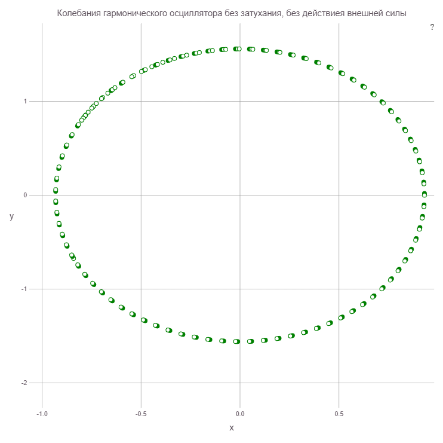
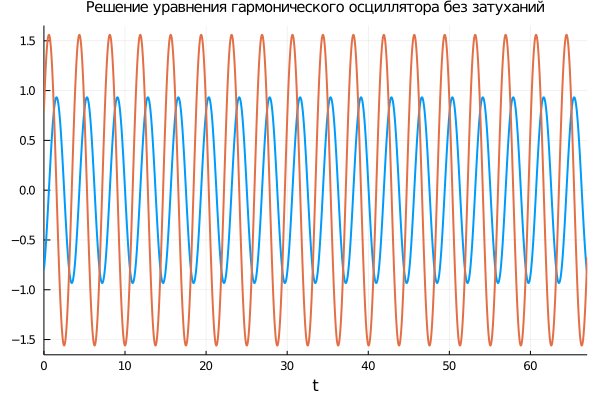
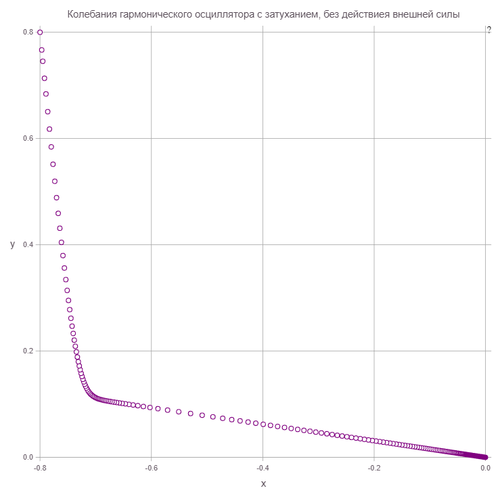
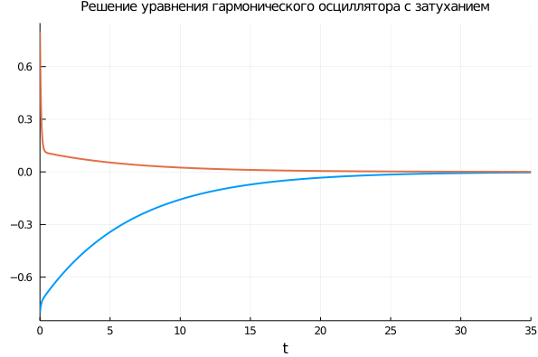
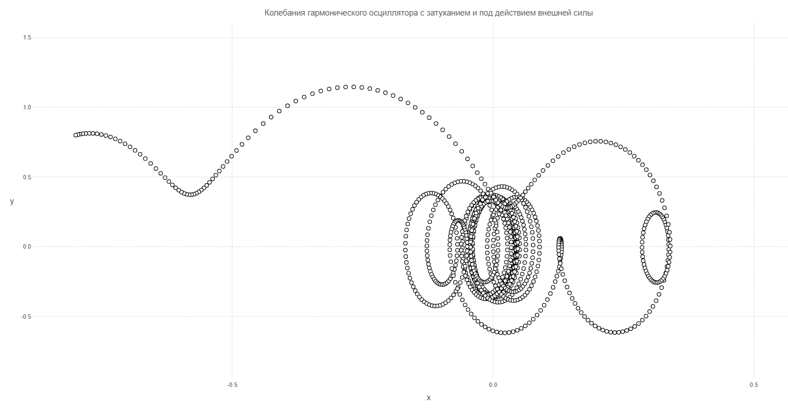
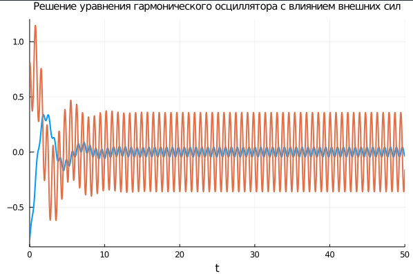

---
## Front matter
lang: ru-RU
title: Модель гармонических коллебаний
author: |Карташова А.С
institute: |
	\inst{1}RUDN University, Moscow, Russian Federation
date: 2021, 05 March
## Formatting
toc: false
slide_level: 2
theme: metropolis
header-includes:
 - \metroset{progressbar=frametitle,sectionpage=progressbar,numbering=fraction}
 - '\makeatletter'
 - '\beamer@ignorenonframefalse'
 - '\makeatother'
aspectratio: 43
section-titles: trueы
---
# Цель работы

Изучить и построить модель линейного гармонического осциллятора

# Задачи

  - Рассмотреть престейшую модель гармонического осциллятора
  - Построить модель гармонического осциллятора в 3-х случаях:

      + Колебания гармонического осциллятора без затуханий и без действий внешней силы

      + Колебания гармонического осциллятора c затуханием и без действий внешней силы

      + Колебания гармонического осциллятора c затуханием и под действием внешней силы


# Выполнение лабораторной работы

## Здача
Построить фазовый портрет гармонического осциллятора и решение уравнения гармонического осциллятора для следующих случаев:

1. Колебания гармонического осциллятора без затуханий и без действий внешней силы:

$$\ddot{x}+2.8x = 0$

2. Колебания гармонического осциллятора c затуханием и без действий внешней силы:
$\ddot{x}+13\dot{x}+2x = 0$

3. Колебания гармонического осциллятора c затуханием и под действием внешней силы:
$\ddot{x}+0.8\dot{x}+1.8x = 2.8sin(8t)$

На интервале $t \in[0;67]$(шаг 0.05) с начальными условиями $x_0 = -0.8, y_0 =0.8$


## 1. Колебания гармонического осциллятора без затуханий и без действий внешней силы

Уравнение:

$\ddot{x}+2.8x = 0$

Начальные данные:
- $x_0$ = 0.8
- $y_0$ = -0.8

Параметры:

- $\omega = \sqrt{2.8}

## Решение

Зададим начальные значения и параметры:

```
y0= 0.8
x0 = -0.8
γ = 0
ω = sqrt(2.8)
f(t) = 0.0
```

## Решение

Зададим СДУ, определяем проблему и решаем систему:
```
function syst(du,u,p,t)
    du[1] = u[2]
    du[2] = -ω*ω*u[1]-γ*u[2]-f(t)
end

    u0 = [x0, y0]
    tspan = (0.0, 67)

    prob = ODEProblem(syst, u0, tspan)
    sol = solve(prob, RK4(),reltol=1e-6, timeseries_steps = 0.05)
```

## Решение

Переписываем решение в массив для построения фазового портрета:
```
N = length(sol.u)
J = length(sol.u[1])
U = zeros(N, J)
for i in 1:N, j in 1:J
    U[i,j] = sol.u[i][j]
end
```

## Решение

Вывод фазового портрета:

```
Gadfly.plot(x = U[:,1], y = U[:,2],
Theme(  discrete_highlight_color=x->"green",
        default_color="white",
        key_title_color="black",
        background_color="white",),
Guide.title("Колебания гармонического осциллятора без затухания, без действиея внешней силы"))

```
## Решение

Построение решения:

```
Plots.plot(sol, label = false,
 title = "Решение уравнения гармонического осциллятора без затуханий",
 titlefontsize = 10, lw = 2)
```


## Решение: График №1

Колебания гармонического осциллятора без затуханий и без действий внешней силы(рис. -@fig:001)

{ #fig:001 width=70% }


## Решение: График №2
Решение уравнения гармонического осциллятора без затуханий и без действий внешней силы(рис. -@fig:002)

{ #fig:002 width=70% }


## 2. Колебания гармонического осциллятора с  затуханием и без действий внешней силы

Уравнение:
$\ddot{x}+13\dot{x}+2x = 0$

Параметры:

  - $\omega = \sqrt{2}$  
  - $\gamma = 13$

## Решение


Зададим начальные значения и параметры:

```
y
y0= 0.8
x0 = -0.8
g = 13
w = sqrt(2)
f(t) = 0.0

```
## Решение
Вывод фазового портрета:

```
Plot(x = U[:,1], y = U[:,2],
    Theme(  discrete_highlight_color=x->"purple",
            default_color="white",
            key_title_color="black",
            background_color="white",),
    Guide.title("Колебания гармонического осциллятора c затуханием, без действиея внешней силы"))

```

## Решение

Вывод Решения

```
    using Plots
    Plots.plot(sol, label = false,
   title = "Решение уравнения гармонического осциллятора c затуханием",
   titlefontsize = 10, lw = 2)
```

## Решение: График №3

Колебания гармонического осциллятора c затуханием и без действий внешней силы(рис. -@fig:003)

{ #fig:003 width=70% }

## Решение: График №4

Решение уравнения для модели гармонического осциллятора с затуханиями и без действий внешней силы(рис. -@fig:004)

{ #fig:004 width=70% }

## 3. Колебания гармонического осциллятора c затуханием и под действием внешней силы


Уравнение:

$\ddot{x}+0.8\dot{x}+1.8x = 2.8sin(8t)$

Параметры:

- $\omega = \sqrt{1.8}$  
- $\gamma = 0.8$

## Решение

Начальные значения:

```
y0= 0.8
x0 = -0.8
g = 0.8
w = sqrt(1.8)

#Функция, описывающая влияние внешних сил
f(t) = 2.8*sin(8t)
```

## Решение: График №5

Колебания гармонического осциллятора c затуханием и действием внешней силы(рис. -@fig:005)

{ #fig:005 width=70% }

## Решение: График №6

Решение уравнения для модели гармонического осциллятора с затуханиями и с воздействием внешней силы(рис. -@fig:006)

{ #fig:006 width=70% }


# Выводы

Мы изучили модель линейного гармонического коллебания и построили ее фазовую траекторю и график решения
