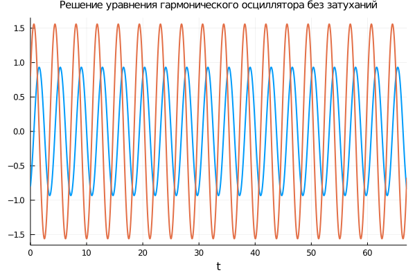
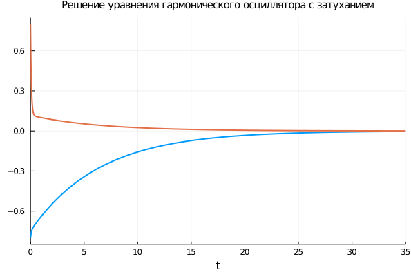
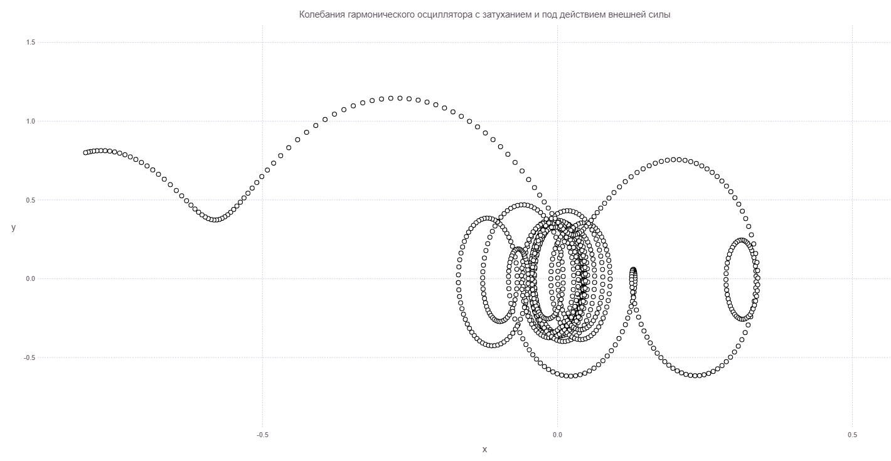
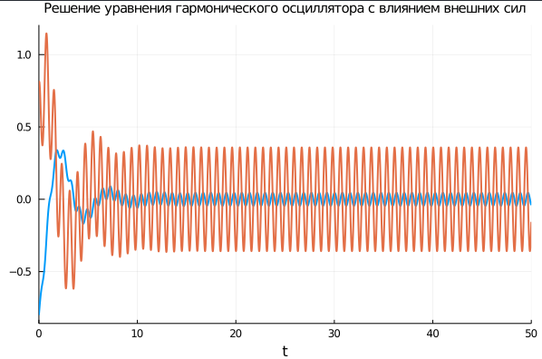

---
# Front matter
lang: ru-RU
title: "Отчет по лабораторной работе №4: Модель гармонических коллебаний"
subtitle: "*дисциплина: Математическое моделирование*"
author: "Карташова Алиса Семеновна, НФИбд-03-18"

# Formatting
toc-title: "Содержание"
toc: true # Table of contents
toc_depth: 2
lof: true # List of figures
lot: true # List of tables
fontsize: 12pt
linestretch: 1.5
papersize: a4paper
documentclass: scrreprt
polyglossia-lang: russian
polyglossia-otherlangs: english
mainfont: PT Serif
romanfont: PT Serif
sansfont: PT Sans
monofont: PT Mono
mainfontoptions: Ligatures=TeX
romanfontoptions: Ligatures=TeX
sansfontoptions: Ligatures=TeX,Scale=MatchLowercase
monofontoptions: Scale=MatchLowercase
indent: true
pdf-engine: luatex
header-includes:
  - \linepenalty=10 # the penalty added to the badness of each line within a paragraph (no associated penalty node) Increasing the value makes tex try to have fewer lines in the paragraph.
  - \interlinepenalty=0 # value of the penalty (node) added after each line of a paragraph.
  - \hyphenpenalty=50 # the penalty for line breaking at an automatically inserted hyphen
  - \exhyphenpenalty=50 # the penalty for line breaking at an explicit hyphen
  - \binoppenalty=700 # the penalty for breaking a line at a binary operator
  - \relpenalty=500 # the penalty for breaking a line at a relation
  - \clubpenalty=150 # extra penalty for breaking after first line of a paragraph
  - \widowpenalty=150 # extra penalty for breaking before last line of a paragraph
  - \displaywidowpenalty=50 # extra penalty for breaking before last line before a display math
  - \brokenpenalty=100 # extra penalty for page breaking after a hyphenated line
  - \predisplaypenalty=10000 # penalty for breaking before a display
  - \postdisplaypenalty=0 # penalty for breaking after a display
  - \floatingpenalty = 20000 # penalty for splitting an insertion (can only be split footnote in standard LaTeX)
  - \raggedbottom # or \flushbottom
  - \usepackage{float} # keep figures where there are in the text
  - \floatplacement{figure}{H} # keep figures where there are in the text
---

# Введение

  Онсновная цель работы - изучить и построить модель линейного гармонического осциллятора

## Задачи работы

Выделим основные задачи работы:

  - Рассмотреть престейшую модель гармонического осциллятора

  - Построить модель гармонического осциллятора в 3-х случаях:


      + Колебания гармонического осциллятора без затуханий и без действий внешней силы

      + Колебания гармонического осциллятора c затуханием и без действий внешней силы

      + Колебания гармонического осциллятора c затуханием и под действием внешней силы


## Объект и предмет исследования

Объектом исследований для данной лабораторной работы является модель   свободных колебаний гармонического осциллятора. Предметом исследования можно назвать модель грармоническо осциллятора с сохранением энргии коллебания.

# Терминология. Условные обозначения

**Осцилля́тор** (лат. oscillo — качаюсь) — система, совершающая колебания, то есть показатели которой периодически повторяются во времени.

**Линейный гармони́ческий осцилля́тор**  — система, которая при выведении её из положения равновесия испытывает действие возвращающей силы $F$, пропорциональной смещению $x$


## Уравнение свободных колебаний гармонического осциллятора

Линеное однородное дифференциальное уравнение второго порядка, является примером динамической системы:

$$\ddot{x}=2\gamma\dot{x}+\omega_0^2x$$  
Обозначения:

$\ddot{x} =\frac{\partial^2x}{\partial t^2}$,  $\dot{x} = \frac{\partial x}{\partial t}$

- $x$ -переменная, описывающая состояние системы(смещение грузаб заряд конденсатора и т.д)
- $\gamma$ - характеризует потерю энергии(трение  в  механической системе, сопротивление в контуре)
- $\omega_0$ -собственная частота колебаниц
- $t$ - время

## Уравнение осциллятора при остутствие потерь в системе($\gamma$ =0)

Энергия колебаний такого консервативного  сохраняется во времени:
$$\ddot{x}+\omega_0^2 x =0$$
Для однозначной решимости уравнеия зададим начальные условия:
$$\begin{cases}
x(t_0) = x_0
\\
\dot{x}(t_0)=y_0
\end{cases}$$

Уравнение  второго порядка представим в виде системы уравнений первого порядка:

$$\begin{cases}
\dot{x}=y
\\
\dot{y} = -\omega_0^2
\end{cases}$$

Тогда начальные условия примут вид:

$$\begin{cases}
x(t_0) = x_0
\\
y(t_0)=y_0
\end{cases}$$


**Фазовая плоскость** - двумерное пространство,которое определено переменными $x$, $y$, в которм "движется" решение

**Фазовая траектория** - гладкая кривая в фазовой плоскости , являющаяся решением уравнения движения как функции времени.

**Фазовый портрет** -  картина, образованная набором фазовых траекторий, когда множество различных решений (соотов. различным начальным условиям) можно изобразить на одной фазовой плоскости.


# Выполнение лабораторной работы

## Формулировка задачи:

**Вариант 57**

Постройте фазовый портрет гармонического осциллятора и решение уравнения гармонического осциллятора для следующих случаев:

1. Колебания гармонического осциллятора без затуханий и без действий внешней силы:
$\ddot{x}+2.8x = 0$

2. Колебания гармонического осциллятора c затуханием и без действий внешней силы:
$\ddot{x}+13\dot{x}+2x = 0$

3. Колебания гармонического осциллятора c затуханием и под действием внешней силы:
$\ddot{x}+0.8\dot{x}+1.8x = 2.8sin(8t)$

На интервале $t \in[0;67]$(шаг 0.05) с начальными условиями $x_0 = -0.8, y_0 =0.8$

## Решение


Учитывая начальные условия и интервал с шагом $0.05$ построим фазовый портрет гармонического осциллятора и решение уравнения гармонического осциллятора для следующих случаев

1. Колебания гармонического осциллятора без затуханий и без действий внешней силы(рис. -@fig:001)(рис. -@fig:002)
$\ddot{x}+2.8x = 0$

Параметр:
- $\omega = \sqrt{2.8}$  

*Решение, реаллизованное с помощью  Julia:*  


```
#Подключим неободимые пакеты
# в этот раз для построения фазовых портретов, используем пакет Gadfly
    using DifferentialEquations
    using Gadfly

#Начальные значения
    y0= 0.8
    x0 = -0.8
#Дифференциальное уравнение гармонического осциллятора имет вид
#x"+γx'+ ωx = f(x)
# Зададftv  параметры
    γ = 0
    ω = sqrt(2.8)
# Задаем СДУ
function syst(du,u,p,t)
    du[1] = u[2]
    du[2] = -w*w*u[1]-g*u[2]-f(t)
end
 #Вектор начальных значений
    u0 = [x0, y0]
#Период дифференцировния
    tspan = (0.0, 67)
#Задаем проблему и решаем СДУ
    prob = ODEProblem(syst, u0, tspan)
    sol = solve(prob, RK4(),reltol=1e-6, timeseries_steps = 0.05)
# Находим колличкство столбцов в массиве решений
        N = length(sol.u)
        J = length(sol.u[1])
# Создаем массив из нулей
        U = zeros(N, J)
#Записываем в массив наши решения
        for i in 1:N, j in 1:J
            U[i,j] = sol.u[i][j]
        end
#Устанавливаем размер графика
set_default_plot_size(20cm, 20cm)
# Рисуем график
plot(x = U[:,1], y = U[:,2],
Theme(  discrete_highlight_color=x->"green",
        default_color="white",
        key_title_color="black",
        background_color="white",),
Guide.title("Колебания гармонического осциллятора без затухания, без действиея внешней силы"))

```

{ #fig:001 width=70% }

{ #fig:002 width=70% }

2. Колебания гармонического осциллятора(рис. -@fig:003) c затуханием и без действий внешней силы(рис. -@fig:004):
$\ddot{x}+13\dot{x}+2x = 0$

Параметры:

  - $\omega = \sqrt{2}$  
  - $\gamma = 13$

*Решение, реаллизованное с помощью  Julia:*  аЛГОРИТ аналогичен предыдущему, изменены лишь начальные значения
```
using DifferentialEquations
using Gadfly


y0= 0.8
x0 = -0.8
g = 13
w = sqrt(2)
f(t) = 0.0


function syst(du,u,p,t)
    du[1] = u[2]
    du[2] = -w*w*u[1]-g*u[2]-f(t)
end


syst(u,p,t) = A * u

u0 = [x0, y0]
tspan = (0.0, 67)

prob = ODEProblem(syst, u0, tspan)
sol = solve(prob, RK4(),reltol=1e-6, timeseries_steps = 0.05)


N = length(sol.u)
J = length(sol.u[1])
U = zeros(N, J)

for i in 1:N, j in 1:J
    U[i,j] = sol.u[i][j]
end
set_default_plot_size(20cm, 20cm)
plot(x = U[:,1], y = U[:,2],
    Theme(  discrete_highlight_color=x->"purple",
            default_color="white",
            key_title_color="black",
            background_color="white",),
    Guide.title("Колебания гармонического осциллятора c затуханием, без действиея внешней силы"))

```

{ #fig:003 width=70% }

{ #fig:004 width=70% }


3. Колебания гармонического осциллятора(рис. -@fig:005) c затуханием и под действием внешней силы(рис. -@fig:006):
$\ddot{x}+0.8\dot{x}+1.8x = 2.8sin(8t)$

Параметры:

- $\omega = \sqrt{1.8}$  
- $\gamma = 0.8$

Начальная функция:

- $f(t) = 2.8sin(8t)$


*Решение, реаллизованное с помощью  Julia:*  


```
using DifferentialEquations
using Gadfly


y0= 0.8
x0 = -0.8
g = 0.8
w = sqrt(1.8)

#Функция, описывающая влияние внешних сил
f(t) = 2.8*sin(8t)

#Задаем СДУ
    function syst(du,u,p,t)
        du[1] = u[2]
        du[2] = -w*w*u[1]-g*u[2]-f(t)
    end

    u0 = [x0, y0]
    tspan = (0.0, 67)
    prob = ODEProblem(syst, u0, tspan)
    sol = solve(prob, RK4(),reltol=1e-6, timeseries_steps = 0.05)

    N = length(sol.u)
    J = length(sol.u[1])
    U = zeros(N, J)
    for i in 1:N, j in 1:J
            U[i,j] = sol.u[i][j]
        end

    set_default_plot_size(40cm, 20cm)

    plot(x = U[:,1], y = U[:,2],
        Theme(  discrete_highlight_color=x->"black",
                default_color="white",
                key_title_color="black",
                background_color="white",),
        Guide.title("Колебания гармонического осциллятора c затуханием и под действием внешней силы"))
```


{ #fig:005 width=70% }

{ #fig:006 width=70% }


# Выводы

Мы изучили модель линейного гармонического коллебания и построили ее фазовую траекторю и график решения
