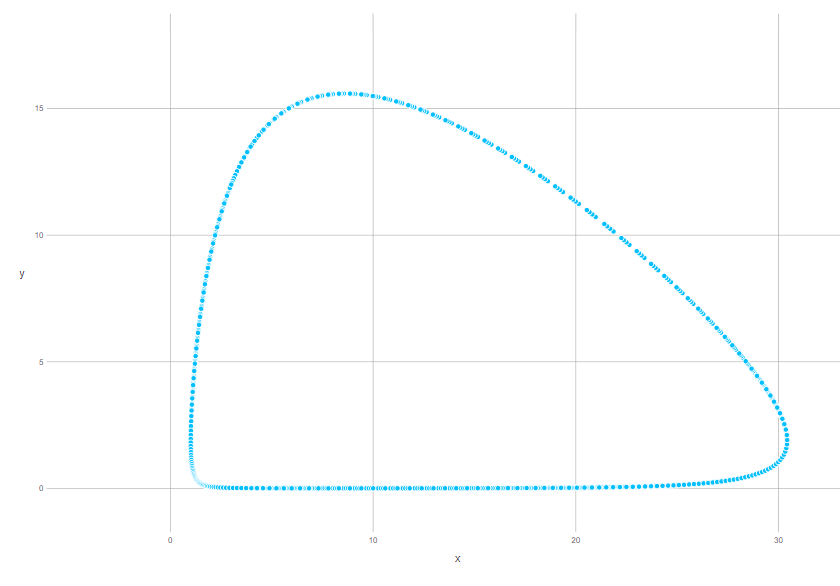
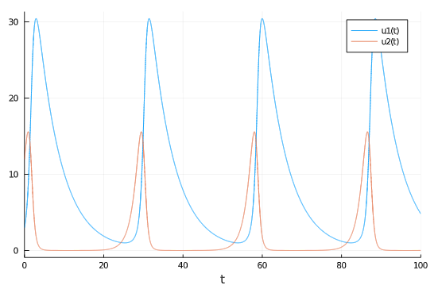

---
## Front matter
lang: ru-RU
title: Модель "Хищник-жертва"
author: | Каратшова Алиса
institute: |
	\inst{1}RUDN University, Moscow, Russian Federation
date: 2021, 12 Marсh
## Formatting
toc: false
slide_level: 2
theme: metropolis
header-includes:
 - \metroset{progressbar=frametitle,sectionpage=progressbar,numbering=fraction}
 - '\makeatletter'
 - '\beamer@ignorenonframefalse'
 - '\makeatother'
aspectratio: 43
section-titles: trueы
---

# Цель работы

*Онсновная цель работы* - изучить модель "хищник-жертва" и построить график зависимости численности популяций хищников и жертв

# Задачи

Выделим основные задачи работы:

- Изучить жесткую модель хищник-жертва
- Изучит модель хищник-жертва с малым изменением
- Построить жесткую модель зависимости численности популяций хищников и жертв


# Выполнение лабораторной работы

## Формулировка задачи

**Вариант 57**

Для модели «хищник-жертва»:

$$
\begin{cases}
\frac{dx}{dt} =  -0.17x(t) + 0.09x(t)y(t)
\\
\frac{dx}{dt} = 0.69y(t) - 0.08x(t)y(t)
\end{cases}
$$

Постройте график зависимости численности хищников от численности жертв, а также графики изменения численности хищников и численности жертв при следующих начальных условиях: $x_0 = 3, y_0 = 12$. Найдите стационарное состояние системы.


## Решение: Коэффиценты

Коэффициент естественной смертности хищников:
a= 0.17
Коэффициент естественного прироста жертв
b= 0.69
Коэффициент увеличения числа хищников
c= 0.09
Коэффициент смертности жертв
d= 0.08

**Начальные значения:**

- $x_0 = 3$
- $y_0 = 12$

## Решение: CДУ

```
function syst(du,u,p,t)
du[1] = -a*u[1]+c*u[1]*u[2]
du[2] = b*u[2]-d*u[1]*u[2]
end

u0 = [x0, y0];
tspan = (0, 100);

prob = ODEProblem(syst, u0, tspan);
sol = solve(prob, RK4(),reltol=1e-6, timeseries_steps = 0.05);

```

## Решение: массив


```
N = length(sol.u)
    J = length(sol.u[1])
    U = zeros(N, J)

    for i in 1:N, j in 1:J
        U[i,j] = sol.u[i][j]
    end

```


## Решение: вывод графиков

Выводим график зависимости численности хищников от численности жертв

```
set_default_plot_size(30cm, 20cm)
Gadfly.plot(x = U[:,1], y = U[:,2])
```
Выводим график изменения численности хищников и численности жертв:

```
Plots.plot(sol)
```

## Решение: график зависимости  хищников от жертв

График зависимости численности хищников от численности жертв(рис. -@fig:001)

{ #fig:001 width=70% }


## Решение: График изменения численности

График изменения численности хищников и численности жертв

- u1(t) - изменение численности хищников
- u2(t) - изменение численности жертв


{ #fig:002 width=70% }


# Выводы

Мы изучили модель "хищник-жертва" и построили график зависимости численности хищников от численности жертв, а также графики изменения численности хищников и численности жертв
