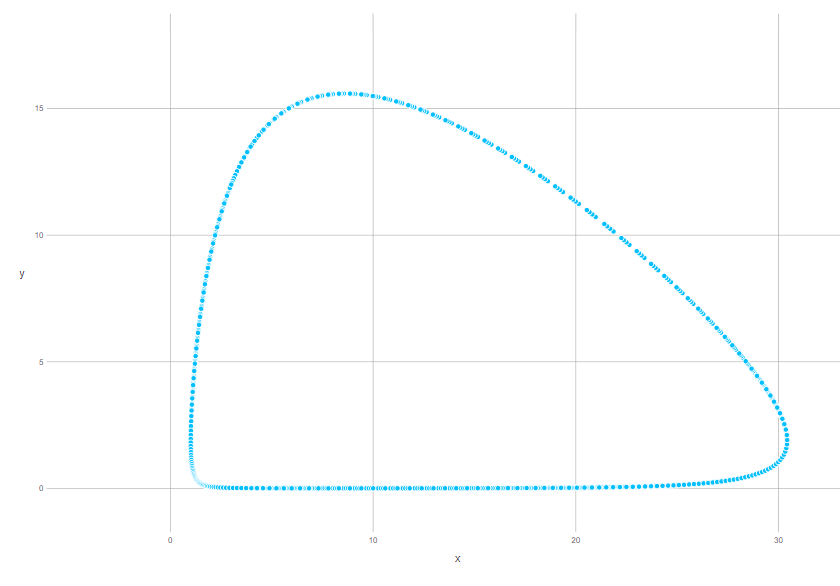
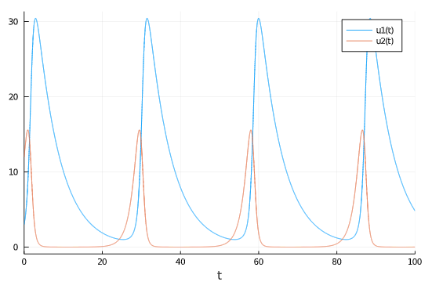

---
# Front matter
lang: ru-RU
title: "Отчет по лабораторной работе №5: Модель "Хищник-жертва"
subtitle: "*дисциплина: Математическое моделирование*"
author: "Карташова Алиса Семеновна, НФИбд-03-18"

# Formatting
toc-title: "Содержание"
toc: true # Table of contents
toc_depth: 2
lof: true # List of figures
#lot: true # List of tables
fontsize: 12pt
linestretch: 1.5
papersize: a4paper
documentclass: scrreprt
polyglossia-lang: russian
polyglossia-otherlangs: english
mainfont: PT Serif
romanfont: PT Serif
sansfont: PT Sans
monofont: PT Mono
mainfontoptions: Ligatures=TeX
romanfontoptions: Ligatures=TeX
sansfontoptions: Ligatures=TeX,Scale=MatchLowercase
monofontoptions: Scale=MatchLowercase
indent: true
pdf-engine: luatex
header-includes:
  - \linepenalty=10 # the penalty added to the badness of each line within a paragraph (no associated penalty node) Increasing the value makes tex try to have fewer lines in the paragraph.
  - \interlinepenalty=0 # value of the penalty (node) added after each line of a paragraph.
  - \hyphenpenalty=50 # the penalty for line breaking at an automatically inserted hyphen
  - \exhyphenpenalty=50 # the penalty for line breaking at an explicit hyphen
  - \binoppenalty=700 # the penalty for breaking a line at a binary operator
  - \relpenalty=500 # the penalty for breaking a line at a relation
  - \clubpenalty=150 # extra penalty for breaking after first line of a paragraph
  - \widowpenalty=150 # extra penalty for breaking before last line of a paragraph
  - \displaywidowpenalty=50 # extra penalty for breaking before last line before a display math
  - \brokenpenalty=100 # extra penalty for page breaking after a hyphenated line
  - \predisplaypenalty=10000 # penalty for breaking before a display
  - \postdisplaypenalty=0 # penalty for breaking after a display
  - \floatingpenalty = 20000 # penalty for splitting an insertion (can only be split footnote in standard LaTeX)
  - \raggedbottom # or \flushbottom
  - \usepackage{float} # keep figures where there are in the text
  - \floatplacement{figure}{H} # keep figures where there are in the text
---

# Введение

## Цель работы

  Онсновная цель работы - изучить модель "хищник-жертва" и построить график зависимости численности популяций хищников и жертв

## Задачи работы

Выделим основные задачи работы:

- Изучить жесткую модель хищник-жертва
- Изучит модель хищник-жертва с малым изменением
- Построить жесткую модель зависимости численности популяций хищников и жертв


# Терминология. Условные обозначения

Простейшая модель взаимодействия двух видов типа «хищник — жертва» - *модель Лотки-Вольтерры*. Данная двувидовая модель основывается на следующих предположениях:

1. Численность популяции жертв $x$ и хищников $y$ зависят только от времени
2. В отсутствии взаимодействия численность видов изменяется по модели Мальтуса, при этом число жертв увеличивается, а число хищников падает
3. Естественная смертность жертвы и естественная рождаемость хищника несущественны
4. Эффект насыщения численности обеих популяций не учитывается
5. Скорость роста численности жертв уменьшается пропорционально численности хищников

## Жесткая модель Лотки-Вольтеры

**Математическа модель**


$$
\begin{cases}
\frac{dx}{dt} =  ax(t) - bx(t)y(t)
\\
\frac{dx}{dt} =  -cy(t) + dx(t)y(t)
\end{cases}
$$

- $x$ - число жертв
- $y$ - число хищников
- $a$ -  коэффициент, описывающий скорость естественного прироста числа жертв в отсутствие хищников
- $c$ - естественное вымирание хищников, лишенных пищи в виде жертв.

*Особенности модели*:

- Вероятность взаимодействия жертвы и хищника пропорциональна как количеству жертв, так и числу самих хищников (xy).
- Каждый акт взаимодействия уменьшает популяцию жертв, но способствует увеличению популяции хищников.

Математический анализ жесткой модели показывает, что имеется стационарное состояние, всякое же другое начальное состояние(B) приводит к периодическому колебанию численности как жертв, так и хищников, так что по прошествии некоторого времени система возвращается в состояние B.

## Стационарное состояние

Стационарное состояние системы (положение равновесия, не зависящее от времени решение) будет в точке:

$$x_0 = \frac{c}{d}
\\
y_0 = \frac{a}{d}$$

Если начальные значения задать в стационарном состоянии $x(0) = x_0, y(0)=y_0$, то в любой момент времени численность популяций изменяться не будет.

При малом  от положения равновесия численности как хищника, так и жертвы с течением времени не возвращаются к равновесным значениям, а совершают периодические колебания вокруг стационарной точки. Амплитуда колебаний и их период определяется начальными значениями численностей $x(0), y(0) $. Колебания совершаются в противофазе.

## Малое изменение модели

При малом изменении модели:


$$
\begin{cases}
\frac{dx}{dt} =  ax(t) - bx(t)y(t) + \varepsilon f(x,y)
\\
\frac{dx}{dt} = -cy(t) + dx(t)y(t) + \varepsilon g(x,y), \varepsilon \ll 1
\end{cases}
$$

Прибавленые к правым частям малые члены, учитывают конкуренцию жертв за пищу и хищников за жертв и т.п.

Вывод о периодичности, справедливый для жесткой системы Лотки-Вольтерры, теряет силу. Таким образом, мы получаем так называемую мягкую модель «хищник-жертва».

В зависимости от вида малых поправок f и g возможны 3 варианта:

1. Равновесное состояние A устойчиво. При любых других начальных условиях через большое время устанавливается именно оно.
2. Система стационарное состояние неустойчиво. Эволюция приводит то к резкому увеличению числа хищников, то к их почти полному вымиранию.
3. В системе с неустойчивым стационарным состоянием A с течением времени устанавливается периодический режим. В отличие от исходной жесткой модели Лотки-Вольтерры, в этой модели установившийся периодический режим не зависит от начального условия. Первоначально незначительное отклонение от стационарного состояния A приводит не к малым колебаниям около A, как в модели Лотки-Вольтерры, а к колебаниям вполне определенной (и не зависящей от малости отклонения)

**Вывод:** жесткую модель всегда надлежит исследовать на структурную устойчивость полученных при ее изучении результатов по отношению к малым изменениям модели (делающим ее мягкой).


# Выполнение лабораторной работы

## Формулировка задачи:

**Вариант 57**

Для модели «хищник-жертва»:

$$
\begin{cases}
\frac{dx}{dt} =  -0.17x(t) + 0.09x(t)y(t)
\\
\frac{dx}{dt} = 0.69y(t) - 0.08x(t)y(t)
\end{cases}
$$


Постройте график зависимости численности хищников от численности жертв, а также графики изменения численности хищников и численности жертв при следующих начальных условиях: $x_0 = 3, y_0 = 12$. Найдите стационарное состояние системы.


## Решение

*Коэффиценты:*

Коэффициент естественной смертности хищников:
a= 0.17
Коэффициент естественного прироста жертв
b= 0.69
Коэффициент увеличения числа хищников
c= 0.09
Коэффициент смертности жертв
d= 0.08

*Начальные значения:*

- $x_0 = 3$
- $y_0 = 12$

*Код на Julia:*

```
using  Gadfly
using Plots
using DifferentialEquations

a= 0.17;
b= 0.69;
c= 0.09;
d= 0.08;
x0 = 3;
y0 =12;

    function syst(du,u,p,t)
        du[1] = -a*u[1]+c*u[1]*u[2]
        du[2] = b*u[2]-d*u[1]*u[2]
    end

u0 = [x0, y0];
tspan = (0, 100);


prob = ODEProblem(syst, u0, tspan);
sol = solve(prob, RK4(),reltol=1e-6, timeseries_steps = 0.05);

N = length(sol.u)
    J = length(sol.u[1])
    U = zeros(N, J)

    for i in 1:N, j in 1:J
        U[i,j] = sol.u[i][j]
    end

set_default_plot_size(30cm, 20cm)
Gadfly.plot(x = U[:,1], y = U[:,2])

Plots.plot(sol)


```


{ #fig:001 width=70% }

{ #fig:002 width=70% }


- u1(t) - изменение численности хищников
- u2(t) - изменение численности жертв


# Выводы

Мы изучили модель "хищник-жертва" и построили график зависимости численности хищников от численности жертв, а также графики изменения численности хищников и численности жертв
