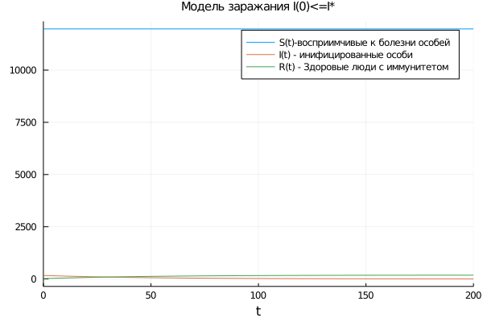
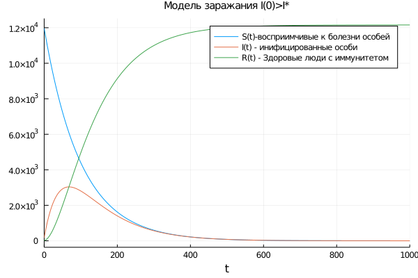

---
## Front matter
lang: ru-RU
title: 'Модель "Распостронение эпидемии"'
author: Каратшова Алиса
date: 2021, 18 Marсh

## Formatting
toc: false
slide_level: 2
theme: metropolis
header-includes:
 - \metroset{progressbar=frametitle,sectionpage=progressbar,numbering=fraction}
 - '\makeatletter'
 - '\beamer@ignorenonframefalse'
 - '\makeatother'
aspectratio: 43
section-titles: true
---

# Цель работы

*Онсновная цель работы* - Изучить простейшую модель эпидемии. Построить модели 2-х случаев распостранения болезни.

# Задачи

Выделим основные задачи работы:

- Изучить модель эпидемии с условием того, что число заболевших не превысит критического значения

- Изучить модель эпидемии с условием того, что число заболевших привышает критическое значение

- Построить модели 2-х случаев распостронения болезни


# Выполнение лабораторной работы

## Формулировка задачи

**Вариант 57**

На одном острове вспыхнула эпидемия. Известно, что из всех проживающих на острове ($N = 12159$) в момент начала эпидемии ($t = 0$) число заболевших людей (являющихся распространителями инфекции) $I(0)=169$, А число здоровых людей с иммунитетом к болезни $R(0)=17$. Таким образом, число людей восприимчивых к болезни, но пока здоровых, в начальный момент времени $S(0)=N-I(0)-R(0)$.

Постройте графики изменения числа особей в каждой из трех групп.

Рассмотрите, как будет протекать эпидемия в случае:

1. Если $I(0) \leq I^*$
2. Если $I(0) > I^*$

## Решение: Коэффиценты

Коэффициент заболеваемости:

a = 0.01

Коэффициент выздоровления:

b = 0.02


## Решение: Начальные значения

**Начальные значения:**

Общая численность популяции:

$N = 12159$

Количество инфицированных особей в начальный момент времени:

$I(0)=169$

Число здоровых людей с иммунитетом к болезни:

 $R(0)=17$

## Решение: CДУ для 1-ого случая

```
function sys1(du,u,p,t)
    du[1] = 0
    du[2] = -b*u[2]
    du[3] = b*u[2]
end
u0 = [S0, I0, R0]
tspan = (0, 200)
p = ODEProblem(sys1, u0, tspan)
sol = solve(p, timeseries_steps = 0.01);


```
## Решение: CДУ для 2-ого случая

```
function sys2(du,u,p,t)
    du[1] = -a*u[1]
    du[2] = a*u[1] - b*u[2]
    du[3] = b*u[2]
end
u0 = [S0, I0, R0]
tspan = (0, 1000)
p2 = ODEProblem(sys2, u0, tspan)
sol2 = solve(p2, timeseries_steps = 0.01);

```
## Решение: вывод графиков

Выводим график изменения числености заболевших для 1-ого случая:

```

plot(sol,
    label = ["S(t)-восприимчивые к болезни особей" "I(t) - инифицированные особи" "R(t) - Здоровые люди с иммунитетом"],
    title = "Модель заражания I(0)<=I*",
    titlefontsize = 10)
```
## Решение: вывод графиков

Выводим график изменения числености заболевших для 2-ого случая:

```
plot(sol2,
    label = ["S(t)-восприимчивые к болезни особей" "I(t) - инифицированные особи" "R(t) - Здоровые люди с иммунитетом"],
    title = "Модель заражания I(0)>I*",
    titlefontsize = 10)

```


## Решение: Модель заражения I(0) <= I*

Случай №1, когда I(0)<=I*, когда число заболевших не привышает критического значения(рис. -@fig:001)

{ #fig:001 width=70% }


## Решение: Модель заражения I(0) > I*

Случай №2, когда I(0)>I*, когда число заболевших привышает критическое значение(рис. -@fig:002)


{ #fig:002 width=70% }


# Выводы


Мы изучили простейшую модель эпидемии и построили модели 2-х случаев распостронения болезни
