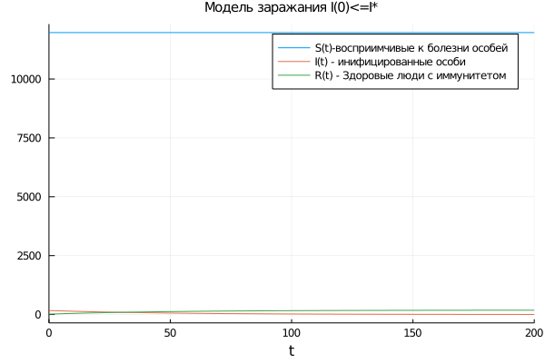
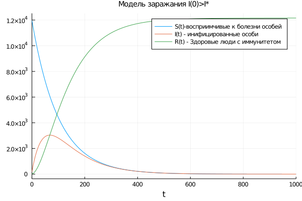

---
# Front matter
lang: ru-RU
title: "Отчет по лабораторной работе №6: Модель 'Распостронение эпидемии'"
subtitle: "*дисциплина: Математическое моделирование*"
author: "Карташова Алиса Семеновна, НФИбд-03-18"

# Formatting
toc-title: "Содержание"
toc: true # Table of contents
toc_depth: 2
lof: true # List of figures
fontsize: 12pt
linestretch: 1.5
papersize: a4paper
documentclass: scrreprt
polyglossia-lang: russian
polyglossia-otherlangs: english
mainfont: PT Serif
romanfont: PT Serif
sansfont: PT Sans
monofont: PT Mono
mainfontoptions: Ligatures=TeX
romanfontoptions: Ligatures=TeX
sansfontoptions: Ligatures=TeX,Scale=MatchLowercase
monofontoptions: Scale=MatchLowercase
indent: true
pdf-engine: luatex
header-includes:
  - \linepenalty=10 # the penalty added to the badness of each line within a paragraph (no associated penalty node) Increasing the value makes tex try to have fewer lines in the paragraph.
  - \interlinepenalty=0 # value of the penalty (node) added after each line of a paragraph.
  - \hyphenpenalty=50 # the penalty for line breaking at an automatically inserted hyphen
  - \exhyphenpenalty=50 # the penalty for line breaking at an explicit hyphen
  - \binoppenalty=700 # the penalty for breaking a line at a binary operator
  - \relpenalty=500 # the penalty for breaking a line at a relation
  - \clubpenalty=150 # extra penalty for breaking after first line of a paragraph
  - \widowpenalty=150 # extra penalty for breaking before last line of a paragraph
  - \displaywidowpenalty=50 # extra penalty for breaking before last line before a display math
  - \brokenpenalty=100 # extra penalty for page breaking after a hyphenated line
  - \predisplaypenalty=10000 # penalty for breaking before a display
  - \postdisplaypenalty=0 # penalty for breaking after a display
  - \floatingpenalty = 20000 # penalty for splitting an insertion (can only be split footnote in standard LaTeX)
  - \raggedbottom # or \flushbottom
  - \usepackage{float} # keep figures where there are in the text
  - \floatplacement{figure}{H} # keep figures where there are in the text
---

# Введение

## Цель работы

Изучить простейшую модель эпидемии. Построить модели 2-х случаев распостранения болезни

## Задачи работы

Выделим основные задачи работы:

    1. Рассмотреть простейшую модель ипедемии:

            - Изучить модель эпидемии с условием того, что число заболевших не превысит критического значения
            - Изучить модель эпидемии с условием того, что число заболевших привышает критическое значение

    2. Построить модели 2-х случаев распостронения болезни:   

                  - Если $I(0) \leq I^*$
                  - Если $I(0) > I^*$

# Терминология. Условные обозначения

Рассмотрим простейшую модель эпидемии. Предположим, что некая изолированная популяция, состоящая из N особей  подразделяется на три группы:

 - Первая группа - это восприимчивые к болезни, но пока здоровые особи, обозначим их через $S(t)$.

- Вторая группа – это число инфицированных особей, которые также при этом являются распространителями инфекции, обозначим их $I(t)$.

- Третья группа, обозначающаяся через $R(t)$ – это здоровые особи с иммунитетом к болезни.

До того, пока число заболевших не превысит критического значения $I^*$, считаем, что все больные изолированы и не заражают здоровых. Когда $I(t)>I^*$ тогда инфицированые способны заражать восприимчивых к болезни особей.

Таким образом, скорость изменения числа $S(t)$ происходит по следующему закону:

$$
\frac{dS}{dt} =
\begin{cases}
\ -\alpha S, I(t)>I^*
\\
\ 0, I(t)\leq I^*
\end{cases}
$$

Поскольку каждая восприимчивая к болезни особь, которая, в конце концов, заболевает, сама становится инфекционной, то скорость изменения числа инфекционных особей представляет разность за единицу времени между заразившимися и теми, кто уже болеет и лечится, и выражается следующей формулой:

$$
\frac{dS}{dt} =
\begin{cases}
\ \alpha - \beta I ,   I(t)>I^*
\\
\ - \beta I,   I(t)\leq I^*
\end{cases}
$$

А скорость изменения выздоравливающих особей (при этом приобретающие иммунитет к болезни):

$$\frac{dR}{dt} = \beta I$$

- $\alpha$ - коэффициент заболеваемости
- $\beta$ - коэффициент выздоровления

Для того, чтобы решения соответствующих уравнений определялось однозначно, необходимо задать начальные условия .Считаем, что на начало эпидемии в момент времени $t = 0$ нет особей с иммунитетом к болезни $R(0) = 0$, а число инфицированных и восприимчивых к болезни особей $I(0)$ и $S(0)$ соответственно.

 Для анализа картины протекания эпидемии необходимо рассмотреть два случая:

- $I(0) \leq I^*$
- $I(0) > I^*$


# Выполнение лабораторной работы

## Формулировка задачи:

**Вариант 57**

На одном острове вспыхнула эпидемия. Известно, что из всех проживающих на острове ($N = 12159$) в момент начала эпидемии ($t = 0$) число заболевших людей (являющихся распространителями инфекции) $I(0)=169$, А число здоровых людей с иммунитетом к болезни $R(0)=17$. Таким образом, число людей восприимчивых к болезни, но пока здоровых, в начальный момент времени $S(0)=N-I(0)-R(0)$.

Постройте графики изменения числа особей в каждой из трех групп.

Рассмотрите, как будет протекать эпидемия в случае:

1. Если $I(0) \leq I^*$
2. Если $I(0) > I^*$

## Решение

*Коэффиценты:*

Коэффициент заболеваемости:

a = 0.01

Коэффициент выздоровления:

b = 0.02

*Начальные значения:*

Общая численность популяции:

$N = 12159$

Количество инфицированных особей в начальный момент времени:

$I(0)=169$

Число здоровых людей с иммунитетом к болезни:

 $R(0)=17$

Количество восприимчивых к болезни особей в начальный момент времени вычисляется следующей формулой:

$S0 = N - I0 - R0$

*Код на Julia:*

```
using Plots
using DifferentialEquations

a = 0.01;
b = 0.02;

N = 12159;
I0 = 169;
R0 = 17;

S0 = N - I0 - R0;

# случай, когда I(0)<=I*, т.е число заболевших не привышает критического значения
    function sys1(du,u,p,t)
        du[1] = 0
        du[2] = -b*u[2]
        du[3] = b*u[2]
    end
 u0 = [S0, I0, R0]
 tspan = (0, 200)
 p = ODEProblem(sys1, u0, tspan)
 sol = solve(p, timeseries_steps = 0.01);

plot(sol,
    label = ["S(t)-восприимчивые к болезни особей" "I(t) - инифицированные особи" "R(t) - Здоровые люди с иммунитетом"],
    title = "Модель заражания I(0)<=I*",
    titlefontsize = 10)


# случай, когда I(0)>I*, т.е число заболевших привышает критическое значение,
# т.е. инфицированные способны заражать восприимчивых
    function sys2(du,u,p,t)
        du[1] = -a*u[1]
        du[2] = a*u[1] - b*u[2]
        du[3] = b*u[2]
    end
 u0 = [S0, I0, R0]
 tspan = (0, 1000)
 p2 = ODEProblem(sys2, u0, tspan)
 sol2 = solve(p2, timeseries_steps = 0.01);

plot(sol2,
    label = ["S(t)-восприимчивые к болезни особей" "I(t) - инифицированные особи" "R(t) - Здоровые люди с иммунитетом"],
    title = "Модель заражания I(0)>I*",
    titlefontsize = 10)

```


{ #fig:001 width=70% }

{ #fig:002 width=70% }


# Выводы


Мы изучили простейшую модель эпидемии и построили модели 2-х случаев распостронения болезни
