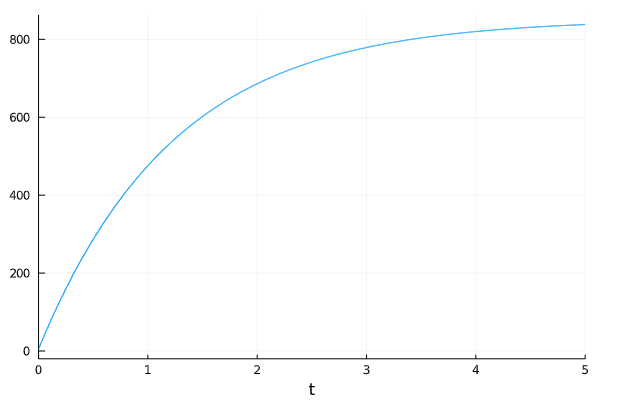
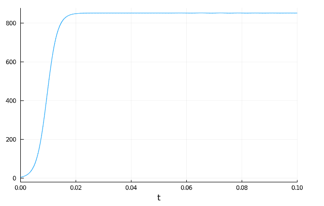
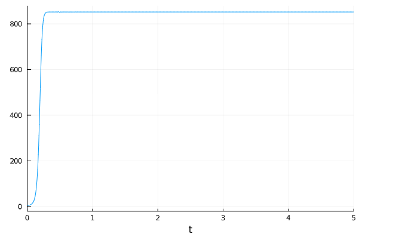

---
## Front matter
lang: ru-RU
title: 'Модель "Эффективность рекламы"'
author: Каратшова Алиса
date: 2021, 25 Marсh

## Formatting
toc: false
slide_level: 2
theme: metropolis
header-includes:
 - \metroset{progressbar=frametitle,sectionpage=progressbar,numbering=fraction}
 - '\makeatletter'
 - '\beamer@ignorenonframefalse'
 - '\makeatother'
aspectratio: 43
section-titles: true
---

# Цель работы

*Онсновная цель работы* -остроение математической модели для выбора правильной стратегии при решении задачи об эффективности рекламы.


# Задачи

Выделим основные задачи работы:

1. Изучить теоретическую часть модели, описывающией эффективность рекламы;
2. Реализовать частные случаи модели из моего варианта на одном из представленных языков программирования.

# Выполнение лабораторной работы

## Формулировка задачи

**Вариант 57**


Постройте график распространения рекламы, математическая модель которой описывается следующим уравнением:  
1. $\frac{dn}{dt} = (0.805 + 0.000023 n(t))(N - n(t))$  
2. $\frac{dn}{dt} = (0.000085 + 0.63n(t))(N - n(t))$  
3. $\frac{dn}{dt} = (0.8t + 0.3t n(t))(N - n(t))$  

При этом объем аудитории $N = 852$, в начальный момент о товаре знает 5 человек. Для случая 2 определите в какой момент времени скорость распространения рекламы будет иметь максимальное значение.

## Решение: Коэффиценты №1

Максимальное количество людей, которых может заинтересовать товар:
N = 852;

Количество людей, знающих о товаре в начальный момент времени:
u0 = 5;

Функция, отвечающая за платную рекламу
g(t) = 0.805;

Функция, описывающая сарафанное радио:
v(t) = 0.000023;


## Решение: 1 случай

```
fun(u,p,t) = (g(t)+v(t)*u)*(N-u)

tspan = (0,5);
pr = ODEProblem(fun, u0, tspan);
sol = solve(pr, timeseries_steps = 0.1);

plot(sol,
label = false)

```
## Решение: 2 случай

```
g(t) = 0.000085
v(t)=0.63
fun2(u,p,t) = (g(t)+v(t)*u)*(N-u)

tspan = (0,0.1);
pr2 = ODEProblem(fun2, u0, tspan);
sol2 = solve(pr2, timeseries_steps = 0.1);
plot(sol2,
label = false)


```

## Решение: 2 случай

Вычисление точки максимального распостранения рекламы:

Точка максимального распостранения рекламы достигается при $t = 0.0095$,$u = 421.878$

## Решение: 3 случай


```
g(t) = 0.8*t
v(t)=0.3*t
fun3(u,p,t) = (g(t)+v(t)*u)*(N-u)

tspan = (0,5);
pr3 = ODEProblem(fun3, u0, tspan);
sol3 = solve(pr3, timeseries_steps = 0.1);
plot(sol3,
label = false)

```


## Решение: график 1 случай

График распространения информации о товаре с учетом платной рекламы и с учетом сарафанного радио. Коэффициент $\alpha 1 = 0.805$, коэффициент $\alpha 2 = 0.000023$(рис. -@fig:001)

{ #fig:001 width=70% }


## Решение: график 2 случай

График распространения информации о товаре с учетом платной рекламы и с учетом сарафанного радио. Коэффициент $\alpha 1 = 0.000085$, коэффициент $\alpha 2 = 0.63$ (рис. -@fig:002)


{ #fig:002 width=70% }


## Решение: график 3 случай

График распространения информации о товаре с учетом платной рекламы и с учетом сарафанного радио, точка максимальной скорости распространения. Коэффициент $\alpha 1 = 0.8t$, коэффициент $\alpha 2 = 0.3t)$ (рис. -@fig:003)

{ #fig:003 width=70% }

# Выводы


Мы усвоили основные приципы модели, описывающей эффективность рекламы, а также провели реализацию данной модели в рамках варианта лабораторной работы.
